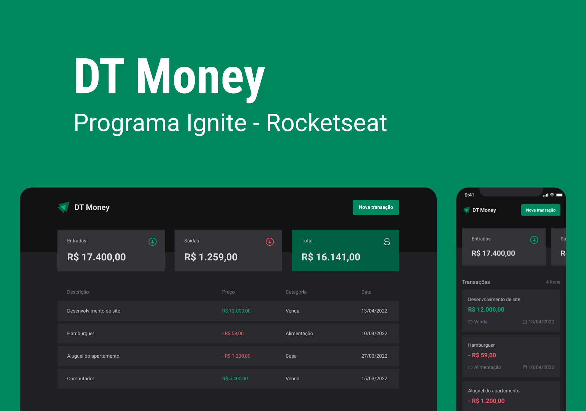

<h1 align="center"> Ignite Timer </h1>

Segundo projeto desenvolvido durante o bootcamp Ignite da Rocketseat.

  <a href="#-projeto">Projeto</a>&nbsp;&nbsp;&nbsp;|&nbsp;&nbsp;&nbsp;
  <a href="#-tecnologias">Tecnologias</a>&nbsp;&nbsp;&nbsp;|&nbsp;&nbsp;&nbsp;
  <a href="#-como-executar">Como executar</a>&nbsp;&nbsp;&nbsp;|&nbsp;&nbsp;&nbsp;
  <a href="#-layout">Layout</a>

 

  

## 💻 Projeto

O DT Money é uma aplicação para gerenciamento de gastos onde é possível visualizar a entrada, saída, total de dinheiro na conta e o histórico de transações.

## ✨ Tecnologias

Esse projeto foi desenvolvido com as seguintes tecnologias:

- ReactJS
- Styled Components
- RadixUI
- JSON Server
- React Hook Form
- Zod
- Axios

## 🚀 Como executar

Para executar a aplicação é necessário usar os seguintes comandos no terminal:
- `npm install` para instalar as dependências da aplicação.
- `npm run dev:server` para iniciar o JSON Server.
- `npm run dev` para executar a aplicação.

## 🔖 Layout

Você pode visualizar o layout do projeto através [DESSE LINK](https://www.figma.com/file/D1eVf94LytlgDxxMTLnn6e/DT-Money?node-id=42013%3A435&t=BmGiYiTPGDPixFFI-1).

